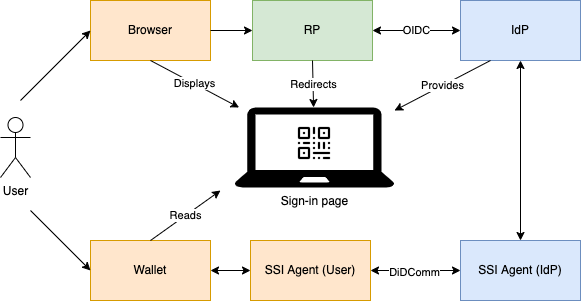

# findy-oidc-provider

[](https://github.com/findy-network/findy-oidc-provider/actions/workflows/test.yml)

Sample PoC project for integrating Aries-agent based authentication to OIDC identity provider. The OIDC provider implementation is [node-oidc-provider](https://github.com/panva/node-oidc-provider) sample code that has been extended with [Findy Agency](https://findy-network.github.io) SSI agent capabilities.

## Overview



## Basic OIDC login flow

```mermaid
sequenceDiagram
    autonumber
    participant User
    participant RP
    participant IdP

    User->>RP: Login
    RP->>IdP: Redirect to IdP auth URL
    IdP-->>User: <<login form>>
    User->>IdP: Login with username and password
    IdP->>RP: Redirect to RelayingParty URL
    rect rgb(248, 248, 248)
    Note right of RP: Auth code flow
    RP->>IdP: Exchange code to access token
    IdP-->>RP: <<token>>
    RP->>IdP: Get user info
    IdP-->>RP: <<info>>
    end
    RP-->>User: Redirect to app
```

## OIDC login flow with DIDComm

```mermaid
sequenceDiagram
    autonumber
    participant AgentUser
    participant User
    participant RP
    participant IdP
    participant AgentIdP

    User->>RP: "Login with Findy"
    RP->>IdP: Redirect to IdP auth URL
    IdP->>AgentIdP: New invitation
    AgentIdP-->>IdP: <<invitation>>
    Note left of IdP: Render invitation QR code
    loop Status check
        IdP->>IdP: Is verification ready?
    end
    rect rgb(248, 248, 248)
    Note right of AgentUser: DIDComm: Credential verification
    User->>AgentUser: Use wallet to read QR code
    AgentUser->>IdP: Read invitation
    AgentUser->>AgentIdP: New pairwise connection
    AgentIdP->>IdP: Pairwise created!
    IdP->>AgentIdP: Request for proof of credential
    AgentIdP->>AgentUser: Send proof request
    AgentUser->>User: Ok to reveal attributes?
    User-->>AgentUser: Ok!
    AgentUser->>AgentIdP: Send proof
    AgentIdP->>AgentIdP: Verify proof
    AgentIdP->>IdP: Proof ok, user attributes
    end
    Note right of IdP: Store user data to cache
    IdP->>IdP: Verification ready!
    IdP->>RP: Redirect to RP callback URL
    rect rgb(248, 248, 248)
    Note right of RP: Auth code flow
    RP->>IdP: Exchange code to access token
    IdP-->>RP: <<token>>
    RP->>IdP: Fetch user info
    IdP-->>RP: <<user info>>
    end
    RP->>RP: Login ready
    RP-->>User: Redirect to app

```

## Running

1. Make sure you have Findy Agency running [locally](https://github.com/findy-network/findy-wallet-pwa/tree/dev/tools/env#agency-setup-for-local-development) or in the cloud.

1. [Setup GitHub package registry authentication](https://docs.github.com/en/packages/working-with-a-github-packages-registry/working-with-the-npm-registry#authenticating-with-a-personal-access-token).

   Run

   ```bash
   echo "@findy-network:registry=https://npm.pkg.github.com" >> .npmrc
   ```

1. Setup node and deps

   ```bash
   nvm use
   npm install

   # generates default clients configuration
   npm run check:clients
   ```

1. Configure client(s). The default client configuration can be found in `src/support/configuration.js`. It matches the local setup for [issuer-tool](https://github.com/findy-network/findy-issuer-tool)

   ```js
   ...
       {
       client_id: "issuer-tool-local",
       client_secret: "superSecretKeyLol",
       grant_types: ["authorization_code"],
       redirect_uris: ["http://localhost:3001/auth/findy"],
       },
   ...
   ```

   If you wish to use other clients, you can add them to file `src/support/clients.js`. Note: this file is excluded from version control.

1. Configure connection to agency. If you are using local agency installation, setting following env vars will do, other settings can use the default values:

   ```bash
   export FINDY_OIDC_AGENCY_PORT="50052"
   export FINDY_OIDC_AGENCY_CERT_PATH="/path/to/findy-wallet-pwa/tools/env/config/cert"
   ```

1. Configure cred def id that the service should use for credential verification:

   ```bash
   export FINDY_OIDC_CRED_DEF_ID="DIDEXAMPLE:1:CL:1234:ftn"
   ```

1. Start service with `npm start`. Generate login URL with your client application. Login page should display the connection invitation QR code.
